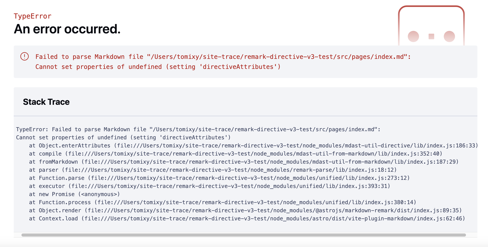

# check remark-directive v3

`remark-directive` v3を使って、Markdownに独自のディレクティブ記法を導入する実験です。

## `vanilla` directory

`unified().use()`を連ねて記述する、一般的な使用法です。

`yarn start`を実行すると、コンソールに、example.mdを変換したHTMLが表示されます。

これは正常に動作しています。

## `astro` directory

AstroのIntegrationとしてディレクティブ記法の変換を実装し、pages配下のMarkdownでディレクティブ記法を使えるようにしたものです。

これはうまく動作しません。

`yarn dev`でローカルサーバーを立ち上げ、トップページをブラウザで表示すると、次のようなエラーになります。

